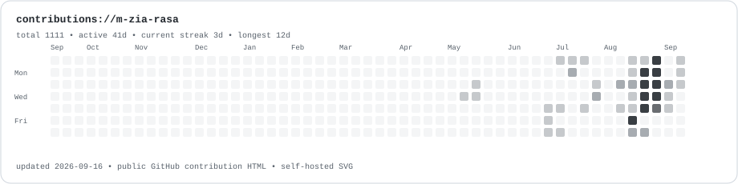

<table>
<tr>
<td valign="top"></td>
<td valign="top"></td>
</tr>
</table>

### Selected work

- **[CodePathAcademy](https://github.com/m-zia-rasa/CodePathAcademy)** — A software project with a live web deployment.
- **[NLP-Llama3-Using-llama3-locally](https://github.com/m-zia-rasa/NLP-Llama3-Using-llama3-locally)** — Local Llama 3 inference with `llama-cpp-python`.
- **[NLP-Hugging_face-Pipelines](https://github.com/m-zia-rasa/NLP-Hugging_face-Pipelines)** — Hugging Face pipelines for generation, summarization, and question answering.
- **[Potato_Disease_Detection](https://github.com/m-zia-rasa/Potato_Disease_Detection)** — A machine-learning model for potato disease detection.

### Connect

[GitHub](https://github.com/m-zia-rasa) · [LinkedIn](https://www.linkedin.com/in/m-zia-rasa-0405771aa/) · [X](https://twitter.com/m_zia_rasa)

Self-hosted animated SVG profile art. The contribution graph refreshes daily from GitHub's public contribution HTML — no paid image service and no personal API token.
